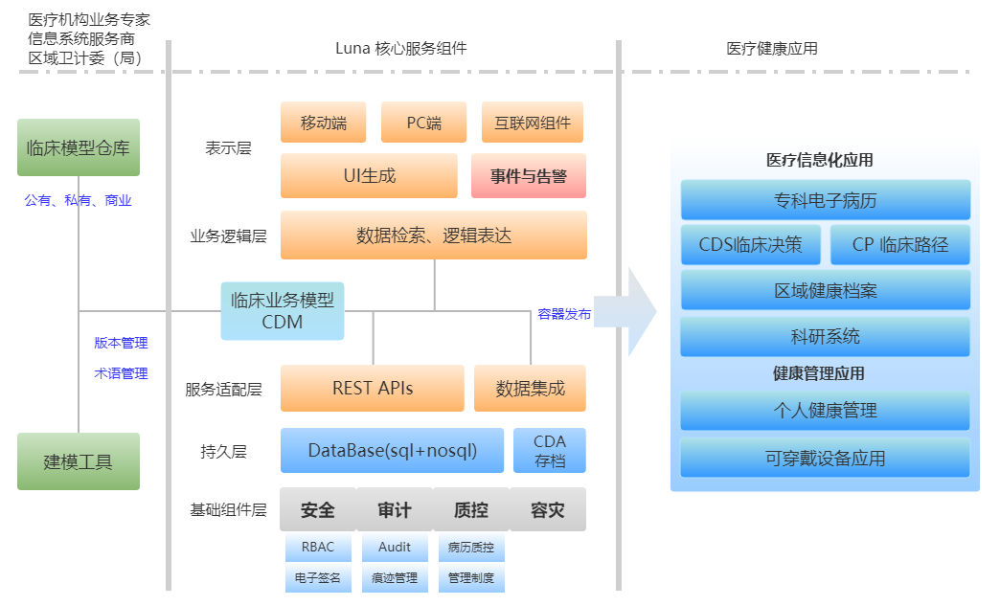
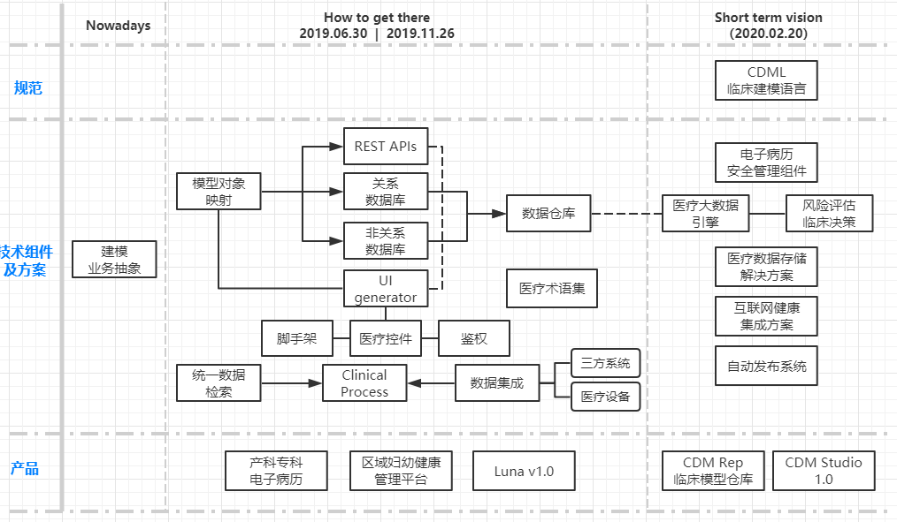

  

<h1 align="center">LUNA</h1>

  

An Open Clinical Information System Development Platform - Especially For Specialist EHR

一款开放的医疗信息系统开发平台，尤其针对专科电子病历的开发

 简体中文 | <a href="./README-zh_CN.md">English(not support yet)</a>

## What is Luna?

Luna is an openEHR based CIS(Clinical Information System) development platform.

一、这里重点提到了openEHR，openEHR是一个致力于电子病历相关系统的国际组织；是一种muti-level,single source modelling的面向服务的软件架构；是一系列分层模型的规范；对我而言他更是一种关于电子病历的方法论：基于几十年的电子病历研发、实施经验的积累和对临床医学、电子病历发展的理解，提出了如何能让电子病历类系统成功实施-符合临床需求指导临床决策-的方向和方法（了解更多，请见reference中的链接）。Luna本质是由临床的专家通过CDML（Clinical Domain Model Language）对医疗信息系统的需求建模，系统后台根据CDM自动生成数据存储层、检索层、展示层及基础的安全等模块和组件，形成一个完整的医疗业务系统。 
二、说到“平台”,这个词已是在国内互联网圈中“普适”的标签。我认为平台本质是服务B端，再通过B端服务C端。不是任何一款多用户应用的软件产品都能称为平台，关键在于能为B端提供什么资源？怎样提供？这些资源是否有利于更好的服务共有的C端？Luna期望服务于医疗信息化服务商、各级医疗机构、区域卫计委（局），最终通过EHR服务医疗参与者。  
 
三.Luna目前仍存在于理想层面，至今甚至没有一行代码。在先辈的成果的基础上从设计每一个模块每一个组件开始积累跬步，希望Luna可以帮助国内医疗信息化的发展。 
 
四.Luna缘起于探月和王者，想想目前lian-med着眼于妇幼、产科领域，月亮的阴晴圆缺与妇也很配。Luna构思于在19年1月初，当时的大事件就是嫦娥工程；Luna也是我钟爱的一个英雄。
 

背景、理念、愿景...
  <a href="./docs/whats-zh.md">For Details</a>

## Technical Roadmap

Luna的核心在于临床业务建模，没有直接用openEHR的Archetype和Template概念集的原因是尽可能采用抽象无歧义的工科术语来表达“把现实需求用抽象、通用、人可读、机器可读的方式表达”这一概念。用数学、工程学、信息学共识的“建模”特别是中文有丰富的含义；所有的技术都是围绕如何将业务模型转化为包含持久层、传输层、展示层的完整软件产品；Luna的最终产品对目前团队来讲会是一个big project，一个巨大挑战，因为就目前而言这是一个理想化的roadmap。

一、CDML
 
二、CDM studio ，符合临床使用习惯，输出人可读，机器可读。
 
三、数据存储层，orm
 
四、统一查询组件
 
五、前端生成器项目
 

  Projects...
  <a href="./docs/roadmap-zh_CN.md">For Details</a>

## Luna In Obstetrics

产科专科电子病历正在国内兴起，同时各种带有医疗性质的母婴健康服务也C端市场蓬勃发展。作为医院科室的一个重要分支，产科信息化发展有着同样的大背景，同时中国地域辽阔极强的区域性在产科业务及学术领域有着明显体现。Lian-Med专注妇产科领域，Luna就以产科小试牛刀，通过模型驱动，建设既符合医院信息系统整体建设规划又满足科室日常高效、便捷运作的产科临床应用系统；通过约束CDML（临床建模语言），促进信息互认共享，确保系统数据的完整性、规范性，建立符合临床和区域特性健康档案建设的产科数据规范；通过产科信息的数据挖掘与综合利用，充分发挥信息在临床决策中和科学研究上的价值，充分发挥信息技术在改善产科质量方面的价值，并形成与时俱进的产科质量管理体系。妇产科相关应用包括，单病种管理（临床路径）系统、临床辅助决策系统、围产保健系统、电子病历（门、急、住院）系统、产前筛查与诊断系统、营养管理、妊娠高危管理、产后康复系统、母子健康手册管理系统、区域妇幼平台等。

  业务抽象、临床领域模型、UI组件、ETL...
  <a href="./docs/obis-zh_CN.md">For Details</a>

## Repository For Models & Templates 

- N/A

## Reference

- [openEHR Specifications](https://specifications.openehr.org/)
- [openEHR Website](https://www.openehr.org/)
