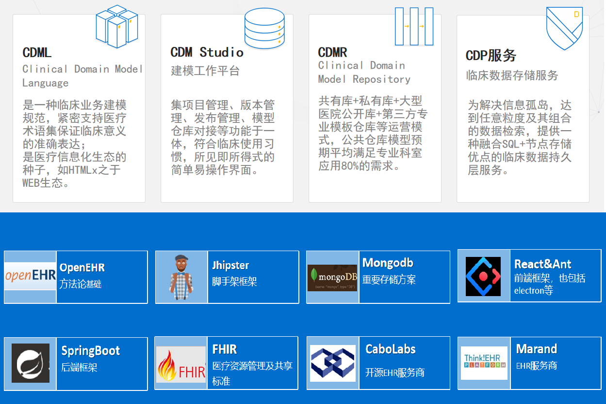

ArchType 
Template
UIDesigner
TestL

CDML Clinical Domain ModelLanguage
是一种临床业务建模规范，紧密支持医疗术语集保证临床意义的准确表达；是医疗信息化生态的种子，如HTMLx之于WEB生态。
CDM Studio 临床建模工作平台
集项目管理、版本管理、发布管理、模型仓库对接等功能于一体，符合临床使用习惯，所见即所得式的简单易操作界面。
CDMR Clinical Domain Model Repository
共有库+私有库+大型医院公开库+第三方专业模板仓库等运营模式，公共仓库模型预期平均满足专业科室应用80%的需求。
CDP 临床数据存储服务
为解决信息孤岛，达到任意粒度及其组合的数据检索，提供一种融合SQL+节点存储优点的临床数据持久层服务。
项目管理组件
将项目需求、评审、开发、测试、上线固化为开发平台流程；完整的过程记录、自动文档生成、审批体系、版本回滚制度；Docker集成，通过容器构建测试、开发、生成环境。
基础组件
数据存储：结合SQL和文档数据库的特点，保证数据检索效率和业务变更的可扩展性。
服务接口：设计通用的数据查询语言实现任意数据粒度的数据查询与共享，支持HL7 FHIR的资源接口模式。
权限与审计：统一的权限管理、电子签名、审计模块，作为院内基础服务组件为其他模块服务。
全局服务组件：临床决策模块、随访模块、事件告警模块，让传统医疗信息系统支持智慧医疗。

组件式开发

后台组件：权限管理、审计管理、组织管理、模型管理、集成管理
前端组件：表单组件、报表组件、路由组件
第三方组件：临床决策支持组件、语音录入组件、定向推荐组件、控费组件、电子病历组件等

自动化脚手架

以模型为中心，自动生成持久层数据体系和Rest接口，结合表单编辑自动生成前端页面

前后端分离
前端呈现：支持pc和移动端样式
后端：在数据持久层上提供Rest层作为数据检索接口

领域与信息模型分离
临床领域建模：绑定医疗术语集，支持LOINC、SNOMED、ICD.x
信息模型：基础数据支持、数据关系支持、CDS表达式语言、统一查询语言
